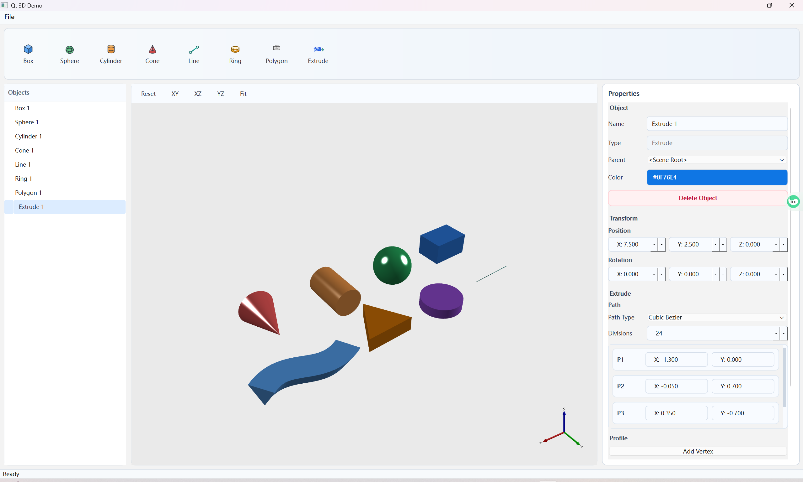

# qt3d-demo

基于 Qt 6、Qt3D 和 CMake 的 QT-3D Demo。展示QT-3D包的核心功能和使用方式



## 当前能力

- 通过顶部工具栏创建 8 类对象：`Box`、`Sphere`、`Cylinder`、`Cone`、`Line`、`Ring`、`Polygon`、`Extrude`
- 左侧对象树支持层级展示、当前对象切换、整树展开和就地重命名
- 中央 Qt3D 视图支持鼠标交互、视角快捷切换、对象拾取和选中高亮
- 右侧属性面板支持编辑名称、父节点、颜色、位移、旋转，以及不同对象类型的专属参数
- `Polygon` 支持顶点列表、拉伸高度、分层数编辑
- `Extrude` 支持路径类型切换、控制点编辑、路径分段数，以及轮廓顶点编辑
- 编辑操作支持 `Undo / Redo`，覆盖对象创建、删除、重命名、变换、父子关系和当前属性面板中的参数修改
- 场景对象支持父子重挂接，并在重挂接时保持世界坐标和世界旋转不变

更完整的现状说明见 [docs/project-summary.md](docs/project-summary.md)。

## 工程结构

- `src/mainwindow.*`: 主窗口、整体布局、工具栏和视图联动
- `src/scene`: 场景对象、控制器，以及 primitive / polygon / extrude 数据模型
- `src/property_panel`: 右侧属性面板和各类编辑器
- `src/visualization/graph3d`: Qt3D 场景、渲染节点工厂、节点同步机制
- `src/q3dextension`: 曲线、几何、shape 和 Qt3D 扩展组件
- `tests`: 核心层、渲染节点、属性面板测试

## 依赖

| 依赖 | 版本要求 |
|------|---------|
| Qt | **6.x**（推荐 6.7+） |
| CMake | 3.21+ |
| vcpkg | 可选；可自动引导，或设置 `VCPKG_ROOT` |
| MSVC | 2019 / 2022 x64（Windows） |

## 构建

### 1. 准备本机 preset

复制模板并填写你的 Qt 6 安装路径：

```powershell
Copy-Item CMakeUserPresets.json.eg CMakeUserPresets.json
```

编辑 `CMakeUserPresets.json`，将路径改为你本机的 Qt 安装前缀，例如：

```json
"CMAKE_PREFIX_PATH": "D:/Qt/6.7.3/msvc2019_64",
"Qt6_DIR": "D:/Qt/6.7.3/msvc2019_64/lib/cmake/Qt6"
```

### 2. 配置并构建

```powershell
# Debug
cmake --preset local-debug
cmake --build --preset local-build-debug

# Release
cmake --preset local-release
cmake --build --preset local-build-release
```

默认可执行文件输出到 `build/presets/debug/Debug/qt3d-demo.exe`。

### 3. 在 CLion 中使用

打开 **Settings -> Build, Execution, Deployment -> CMake**，新建 Profile，并在 **CMake preset** 中选择 `local-debug`。CLion 会自动读取 `CMakeUserPresets.json` 中的路径和环境变量。

## 测试

测试默认关闭。需要时可显式开启：

```powershell
cmake --preset local-debug -DQT3D_DEMO_BUILD_TESTS=ON
cmake --build --preset local-build-debug
```

开启后会生成这些测试目标：

- `render_node_test`
- `property_panel_test`
- `core_test`（需要 `doctest` 包可用）

## 关键 CMake 选项

| 选项 | 默认值 | 说明 |
|------|--------|------|
| `QT3D_DEMO_USE_VCPKG` | `ON` | 启用 vcpkg toolchain 集成 |
| `QT3D_DEMO_ENABLE_BREAKPAD` | `OFF` | 链接 Breakpad 支持 |
| `QT3D_DEMO_BUILD_TESTS` | `OFF` | 构建测试目标 |

## Preset 说明

| Preset | 说明 |
|--------|------|
| `debug` / `release` | 入仓库的共享 preset，不包含本机绝对路径 |
| `local-debug` / `local-release` | 本机 preset，定义 Qt 路径和环境变量 |
| `local-build-debug` / `local-build-release` | 对应的构建 preset，只构建主目标 `qt3d-demo` |
